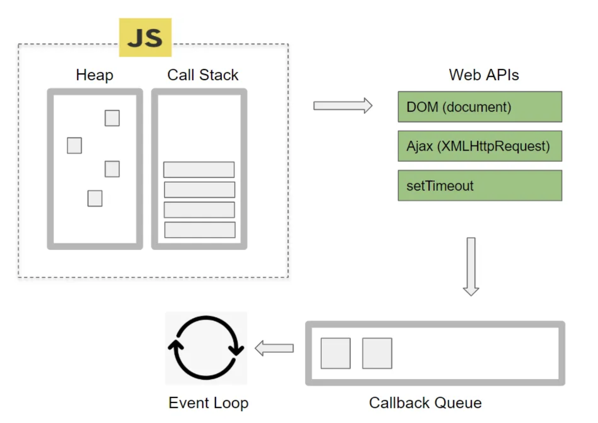

### 호출 스케줄링
일정 시간이 지난 후에 원하는 함수를 예약 실행(호출)할 수 있게 하는 것을
호출 스케줄링이라고 한다.


### setTimeout
일정 시간이 지난 후에 함수를 실행하는 방법
단 한번만 실행된다.
```js
// 3초 뒤에 실행된다.
setTimeout(function a(){
    console.log("헬로우~")
},[3000])
```

### setInterval
일정 시간 간격을 두고 함수를 실행하는 방법
두번째 인자 값 밀리세컨드가 충족되었을 때 마다 실행된다.
```js
// 3초마다 실행된다.
setInterval(function b(){
    console.log("hello world!")
}, 3000)
```

>### Single Thread
프로세스가 단일 스레드로 동작하는 방식이다.

<br />

> ### Multi Thread
두 개 이상의 스레드가 프로세스 내부에서 자원을 공유하여 작업을 수행한다.



- heap: 메모리 할당이 발생하는 곳 함수를 선언하게되면 heap에 담기게된다.

- call Stack: 실행된 코드의 환경을 저장하는 자료구조, 함수를 호출하게 되면
call Stack에 push된다.

- web APIS: setTimeout이 call Stack에 들어와 실행되면 Browser API인
timer를 호출한다. 브라우저가 제공하는 API로 DOM, AJAX, setTimeout등이 있다.

- event Table: 특정 event가 발생했을 때 어떤 callback 함수가 호출되야 하는지를 알고 있는 자료구조이다.

- callback Queue: 이벤트 발생시 실행해야 할 callback 함수가 callback Queue에 추가된다.

- event Loop: call Stack과 callback Queue를 감시한다.
call Stack이 비어있을 경우, callback Queue에서함수를 꺼내 call Stack에 추가한다.

### JavaScript 비동기처리방식
- callback
- promise
- async & await

### promise 객체
promise는 자바스크립트에서 제공하는 비동기를 간편하게 처리할 수 있게 도와주는 객체이다.
callback함수의 단점을 보완하여 비동기처리에 사용되는 객체를 promise라 한다.
promise생성자 안에 두 개의 매개변수를 가진 콜백함수를 넣게 되는데 첫번째 인수는 작업이 성공(resolve)했을 때 성공임을 알려주는 객체이며, 두번째 인수는 작업이 실패했을 때 실패(reject)임을 알려주는 오류 객체이다.
promise는 코드에서 바로 값을 return 하지 않는 대신 promise를 return하여
최종적으로 나중에 값을 제공하는 것을 뜻한다.
-> 성공했을 때는 resolve 함수를 호출하고, 실패했을 때는 reject함수를 호출한다.

* executor: promise생성자 안에 들어가는 콜백함수를 executor라고 부른다.
```js
const promise = new Promise((resolve, reject) => {
    const data = fetch("http://google.com")
    // 요청이 성공하여 데이터가 있다면 실행된다.
    if(data){
        resolve(data)
    // 요청이 실패하여 데이터가 없다면 에러가 발생한다.
    }else{
        reject("Error")
    }
})
```
### Promise의 용도
일반적으로 HTTP를 호출할때 가장 많이 사용된다.
JavaScript엔진은 promise가 최종적으로 값을 return하기 전까지 `pending`상태가 return되고 JavaScript엔진은 다른 코드들을 실행하게 된다.

### promise의 3가지 상태
promise의 상태란 promise의 처리과정을 말한다. new Promise()로 promise를 생성하고
종료될 때까지 3가지 상태를 갖는다.
        
       fullFilled
          /   
pending -    
          \
       rejected

01. 실행전
Pending(대기): 비동기 처리 로직이 아직 미완료인 상태
아래와 같이 promise를 호출하면 pending상태가 된다. 이때 콜백함수의 인자로 resolve, reject에 접근할 수 있다.
```js
new Promise(function(resolve, reject){})
```

02. 실행 후 성공했을 때 
fullFilled(이행): 비동기 처리가 완료되어 promise가 결과 값을 반환해준 상태
콜백함수의 인자 resolve를 실행하면 fullFilled 상태가 된다.(완료상태)
이후 이행 상태가 되면 then()을 이용해 처리 결과 값을 받을 수 있다.
```js
new Promise(function(resolve, reject){
    resolve()
})
```

03. 실행 후 실패했을 때
rejected(실패): 비동기 처리가 실패하거나 오류가 발생한 상태
콜백 함수의 인자 reject를 실행하면 rejected 상태가 된다(실패 상태) 
이후 실패 상태가 되면 catch()를 이용해 error를 다룰 수 있다.
```js
new Promise(function(resolve, reject){
    reject()
})
```
### method chaining 후속 처리메서드
위와같이 만들어진 Promise객체는 비동기 작업이 완료된 이후에 다음 작업을 연결시켜 진행할 수 있다. 작업 결과에 따라 .then()과 .catch()메서드 체이닝을 통해 성공과 실패에 대한
후속처리를 진행할 수 있다. 

- .then: 첫번째 인자(fullFilled function), 두번재 인자(rejected function)를 넣어서 해당 함수를 동작시킨다.

- .catch: 하나의 콜백함수를 인자로 받는다. catch메서드 이후에도 method chaining이 가능하다. promise에서 발생하는 모든 에러처리를 담당한다. 

- .finally: promise가 settled된 상태에서 무조건 한번 실행된다.
콜백함수의 return값이 적용되지 않는다.


```js
const promise = new Promise((resolve, reject) => {
    // 처리할 내용
})

promise.then(
    // resolve가 호출되면 then실행
)
.catch(
    // reject가 호출되면 catch가 실행
)
.finally(
    // callback 작업을 마치고 무조건 실행되는 finally(생략가능)
)
```

### Callback Hell, Promise Hell
Callback Hell의 발생으로 promise객체를 사용했으나 promise도 마찬가지로
Promise Hell이 발생한다. Callback Hell은 코드가 활처럼 굽어 보기어려워지고,
Promise Hell도 then핸들러 남용으로 구현 의도를 파악할 수 없다.
async, await은 이런 문제들을 해결하기 위해 탄생하였으며, 가독성과 유지보수성을
향상 시켜준다.
```js
// Callback Hell
getA(function (x){
    getB(x, function(y){
        getC(y, function(z){
            ...
        })
    })
})

// Promise Hell
fetch("http://naver.com")
    .then(response => response.json())
    .then(data => fetch("https://naver.com"))
    .then(response => response.json())
    .then(data => fetch("https://google.com"))
    .then(response => response.json())
    .then(data => console.log(data))
    .catch(error => console.error(error))

// async && await
async function A(){
    const res = await fetch("http://naver.com")
    const data = await res.json()

    const res2 = await fetch("http://")
    const data2 = await res2.json()

    const res3 = await fetch("http://")
    const data3 = await res3.json()

    console.log(data3)
}

getData()
```

### async, await
async, await문법을 사용하면 promise를 편리하게 사용할 수 있다.
function키워드 앞에 async를 붙여주고 비동기로 처리 될 부분에 await을
붙여주면 된다. async는 return값으로 promise객체를 반환한다.


### async
```js
// 기본형태
async function a(){
    return    
}

// function앞에 `async`를 붙이면 해당 함수는 항상 promise를 반환한다.
// promise가 아닌 값을 반환하더라도 이행 상태의 resolved promise로 값을 감싸
// 이행된 promise가 반환되도록한다.

async function promise(){
    return "hello"
}
async가 붙은 함수는 promise를 반환하고 promise가 아닌 것은 promise가 아닌 것은 promise로 감싸 반환한다.
```

### await
JavaScript는 await키워드를 만나면 promise가 처리될 때까지 기다린다.
결과는 그 이후 반환된다. await은 async함수 안에서만 동작한다.
```js
async function a(){
        const promise = new Promise((resolve, reject) => {
            setTimeout(() => {
                resolve("완료!!")
            }, 1000);
        })

        const result = await promise

        alert(result)
    }

a()
```

### throw new Error
JavaScript에서 error라고 인식하지 않아도 내가 생성한 함수의 규칙과
어긋나 에러처리를 하고 싶은 경우에 사용한다.(직접 에러를 발생시키고 싶을 때 사용한다.)
Error생성자와 throw구문을 사용해서 프로그래머가 직접 에러를 발생시킬 수 있다.
throw 이후에 코드는 실행되지 않기 때문에 return을 추가할 필요는 없다!!
```js
const promise = new Promise((resolve, reject) => {
    throw new Error("에러발생")
}).catch(alert)
```

### 예외처리
error발생하면 스크립트가 중단되고 에러가 중단되게 된다. 
즉 오류가 발생하면 프로세스가 죽어버리기해 프로그래밍 언어들은 일반적으로 이러한 상황에 대처하기 위해 예외처리, Exception handling이란 장치들을
마련해놨다. 보통 try catch명령어로 이루어져 있다.

### try catch
먼저 try안의 코드가 실행되고 에러가 없다면 try안의 마지막코드까지 실행되고 catch블록은 건너뛴다. 
에러가 있다면 try안 코드의 실행이 중단되고 catch(err)블록이 실행된다.
변수 err에 상황에 대한 설명이 담긴 에러 객체를 포함한다.
```js
// 기본형태
try{
// code
}catch(err){
// error Handling
}
```

### JSON
JSON은 JavaScript Object Notation의 약자로서 데이터를 문자열의 형태로 나타내기 위해서 사용된다. JSON은 네트워크를 통해 서로 다른 시스템들이 데이터를 주고 받을 때 많이 사용된다.

### JSON.stringify()
JSON.stringify메소드는 인수로 전달받은 JavaScript객체를 문자열로 변환하여 반환한다.
```js
// 기본형태
JSON.stringify(value)

const chopssal = {
    name: "chop", 
    age: 24, 
    weight: 165
    }

const info = JSON.stringify(chopssal)
// {"name":"chop", "age":24, "weight":165}
console.log(info)
```
### JSON.parse()
인수로 전달받은 문자열을 JavaScript객체로 변환하여 반환한다.
text에는 변환할 문자열은 전달한다. 해당 문자열은 `JSON형식`의 문자열이어야한다.
JSON형식에 맞지 않는 문자열을 전달하면 JavaScript는 오류를 발생시킨다.
```html
// 기본형태
JSON.parse(text)

// string => JSON
<body>
    <p id="str">

    </p>
</body>
<script>
    const info = `{
        "name": "chop", 
        "height": 165, 
        "age": 24
    }`
    const items = JSON.parse(info)
    document.getElementById("str").innerHTML = items.name + "," + 
    items.age
</script>
```


### toJSON()
JavaScript의 Date객체의 데이터를 JSON형식의 문자열로 변환하여 반환
이 메소드는 Date.prototype객체에서만 사용할 수 있다.
```html
<body>
    <p id="day"></p>
</body>
<script>
    const date = new Date()
    const change = date.to.JSON()

    document.querySelector("#day").innerHTML = date + "<br />"
    document.querySelector("#day").innerHTML += str
</script>
```

### Date() 생성자
new Date()를 호출하면 새로운 Date객체가 만들어진다
인수를 전달하지 앟으면 현재 날짜와 시간을 가지는 인스턴스를 반환한다.
```js
const date = new Date()

// date: 2023-05-16T05:13:35.704Z
console.log(date)

// 예제
const date = new Date()
console.log("date:", date)
// date: 2023-05-16T05:13:35.704Z

const change = date.toJSON()
console.log("change:", change)
// Tue May 16 2023 14:38:32 GMT+0900 (대한민국 표준시)

const a = document.querySelector("#day").innerHTML = date + `<br />` + date
console.log("a:", a)
// const b = document.querySelector("#day").innerHTML += str
// console.log("b:", b)
```

### 동기(synchronous)와 비동기(Asynchronous)
동기방식은 서버에서 요청을 보냈을 때 응답이 돌아와야 다음 동작을 수행할 수 있다.
즉 A작업이 모두 진행될 때까지 B작업은 대기해야한다.

비동기방식은 반대로 요청을 보냈을 때 응답상태와 상관없이 다음 동작을 수행할 수 있다.
즉 A작업이 시작하면 동시에 B작업이 실행된다.
A작업은 결과값이 나오는대로 출력한다.
```js
console.log("1st")
setTimeout(() => {
    console.log("2nd")
}, 0)
console.log("3rd")
```

### Single Thread, Multi Thread
Javascript의 메인 Thread인 이벤트루프가 single Thread이므로 JavaScript를 
single Thread언어라고 부른다.
하지만 이벤트 루프만 독립적으로 실행되지 않고 웹브라우저나 NodeJS같은 multi Thread환경에서 실행된다.
-> JavaScript는 single Thread이지만, JavaScript런타임은 single Thread가 아니다.

### fetch
fetch함수는 HTTP response객체를 래핑한 promise 객체를 반환한다.
따라서 프로미스의 후속 처리메서드인 then을 사용하여 resolve한 객체를 전달 받을 수 있다.(catch와 finally도 마찬가지이다.)

### fetch함수로 http요청하기
fetch함수에는 HTTP 요청을 전송할 URL, HTTP요청메서드, HTTP요청헤더, 페이로드 등을 설정한 객체를 전달한다. 단순히 원격 API에 있는 데이터를 가져올 때 쓰인다.
fetch함수는 디폴트로 get방식으로 작동한다.
```js
fetch("http://")
    .then((response) => response.json())
    .then((data) => console.log(data))
```

### value
JavaScript에서 값은 원시값과 참고값 두 가지 데이터타입의 값이 존재한다.
>원시값
원시값을 기본자료형(단순한 데이터)를 의미한다. Number, string, boolean, null, undefined 등이 해당된다. 변수에 원시값을 저장하면 변수의 메모리 공간에 실제 데이터 값이 저장된다. 할당된 변수를 조작하려고 하면 저장된 실제 값이 조작된다.

>참조값
여러자료형으로 구성되는 메모리에 저장된 객체이다. object, symbol등이 해당한다.
할당된 변수를 조작하는 것을 객체 자체를 조작하는 것이 아닌 해당 객체의 참조를 조작하는 것이다. 참조값을 복사할 때는 변수가 객체의 참조를 가리키고 있기 때문에 복사된 변수 또한 객체가 저장된 메모리 공간의 참조를 가리키고 있다. 복사를 하고 객체를 수정하면 두 변수는 똑같은 참조를 가리키고 있기 때문에 기존 객체를 저장한 변수에 영향을 끼친다.

### JavaScript 참조 타입의 복사방법
참조타입의 데이터는 복사 시 데이터의 값이 아닌 값이 저장된 메모리의 주소가 저장된다.
따라서 참조타입의 복사방법에는 깊은 복사와 얕은 복사가있다.

### 깊은 복사(deep copy)
`실제값`을 새로운 메모리공간을 확보해 완전히 복사하는 것을 의미한다.
데이터 자체를 통째로 복사하고, 복사된 두 객체는 완전히 독립적인 메모리를 차지한다.
value type의 객체들은 깊은 복사를 하게 된다. 깊은 복사는 인스턴스가 완전히 독립적이다.

arr1은 string배열을 가진다.
arr1에 있는 모든 string들은 깊은 복사가 일어나서 새로운 배열을 생성하여 arr2에 할당한다.(string은 value type이므로 깊은 복사가 일어난다.)
따라서 arr1을 변경하여도 arr2는 값이 변경되지 않는다.

```js
**기존 값에 영향을 끼치지 않는다.**
// arr1: ["chop", "char1ey"]
let arr1 = ["chop", "char1ey"]

// arr2: ["chop", "char1ey"]
let arr2 = arr1 

// str: hello
let str = "hello"
// str: hello
let str2 = str
```

### 얕은 복사(shallow copy)
참조타입 데이터가 저장한 `메모리 주소 값`을 복사한 것을 의미한다.
얕은 복사는 주소 값을 복사하기 때문에 참조하고 있는 실제 값은 같다. 얕은 복사는 아주 최소한만 복사한다. 값을 복사한다 하더라도 인스턴스가 메모리에 새로 생성되지 않는다.
값 자체를 복사하는 것이 아니라 주소값을 복사하여 같은 메모리를 가리키기 때문이다.
얕은 복사시 원본이 변경되지 않도록 주의해야한다.
새로운 인스턴스를 생성하지 않기 때문에 깊은 복사보다 상대적으로 빠르다.
`reference type`을 복사하는 경우 얕은 복사가 일어난다. 
객체를 복사할 때 기존 값과 복사된 값이 같은 참조를 가리키고 있는 것을 말한다.
객체 안에 객체가 있을 경우 한 개의 객체라도 기존 변수의 객체를 참조하고 있다면 이를 얕은복사라고한다. 
-> 데이터가 생성되는것이 아닌 해당 데이터의 참조 값을 전달하여 한 데이터를 공유하는 것이다.
```js
class Address {
    let address: string

    init(_string: String){
        self.address = string
    }
}

let a1 = Address("chop")
let a2 = a1

// 기존 값에 영향을 끼친다.
const a = {
    one: 1,
    two: 2,
}

let b = a
b.one = 3
// {one:3, two:2}
console.log(a)
// {one:3, two: 2}
console.log(b)
```

### Array.prototype.slice()
얕은 복사 방법의 대표적인 예라고 할 수 있다.
`start`부터 `end` 인덱스까지 기존 배열에서 추출하여 새로운 배열을 리턴하는 메소드이다.
만약 `start`와 `end`를 설정하지 않는다면, 기존 배열을 전체 얕은 복사한다.

> start
추출 시작점에 대한 인덱스
- undefined인 경우: 0부터 slice
- 음수를 지정한 경우: 배열의 끝에서부터의 길이를 나타낸다.
ex) slice(-2)를 하면 배열의 마지막 2개 요소를 추출한다.

- 배열의 길이와 같거나 큰 수를 지정한 경우: 빈 배열을 반환한다.

> end
추출을 종료할 기준 인덱스(`end`를 제외하고 그 전까지의 요소만 추출한다.)
- 지정하지 않을 경우: 배열의 끝까지 slice
- 음수를 지정한 경우: 배열의 끝에서부터의 길이를 나타낸다. slice(-2, 1)를 하면 세번째부터 끝에서 두번째 요소까지 추출한다.
- 배열의 길이와 같거나 큰 수를 지정한 경우: 배열의 끝까지 추출


```js
// 기본형태
slice(start, [end])
```

### forEach
forEach메서드는 배열의 요소를 반복하며 함수를 호출한다.
기본적으로 배열에서 루프를 돌 때 사용한다.
```js
array.forEach(function(currentValue, index, arr))
```
> function(currentValue, index, arr): 배열의 각 항목에 대해 실행할 함수
> currentValue: 배열의 값
> index(선택사항): 현재 항목의 인덱스
> arr(선택사항): 현재 항목의 배열 

### map


### filter


